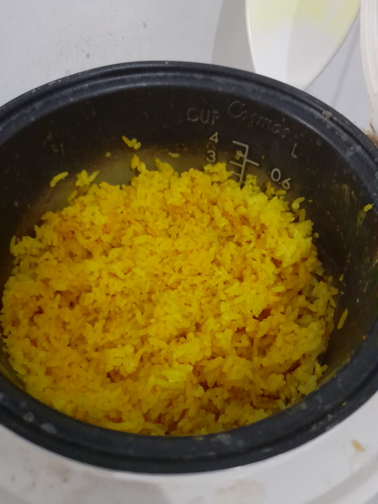
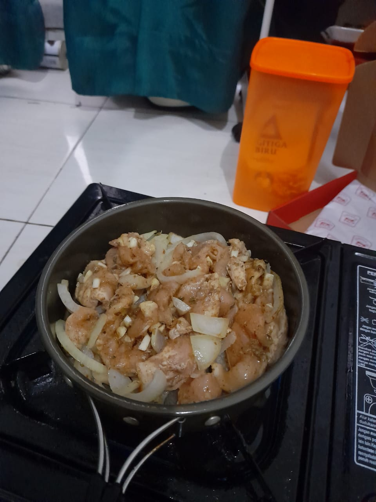
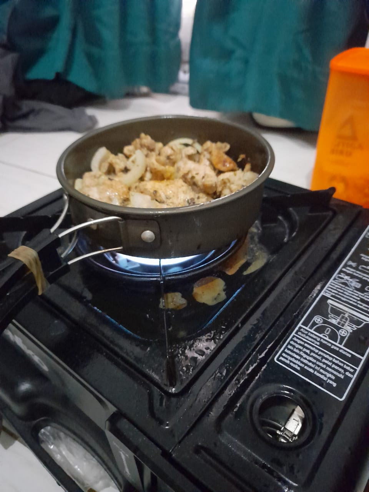
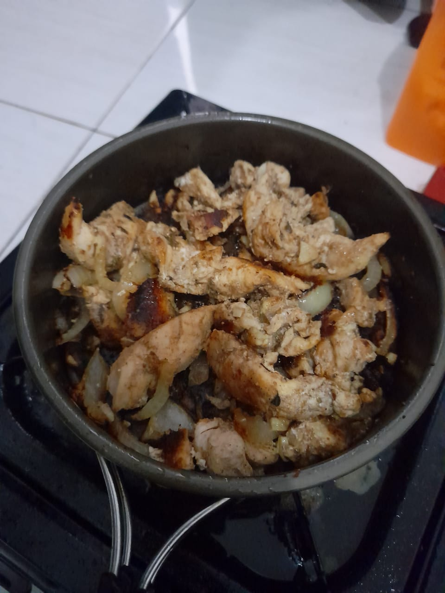
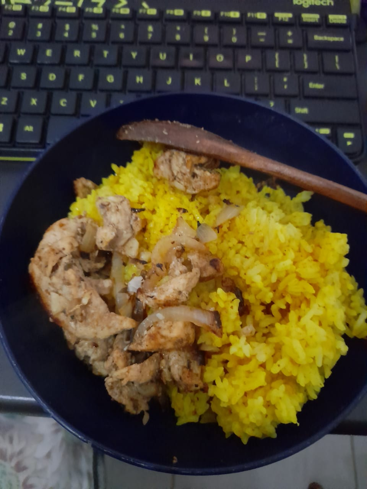
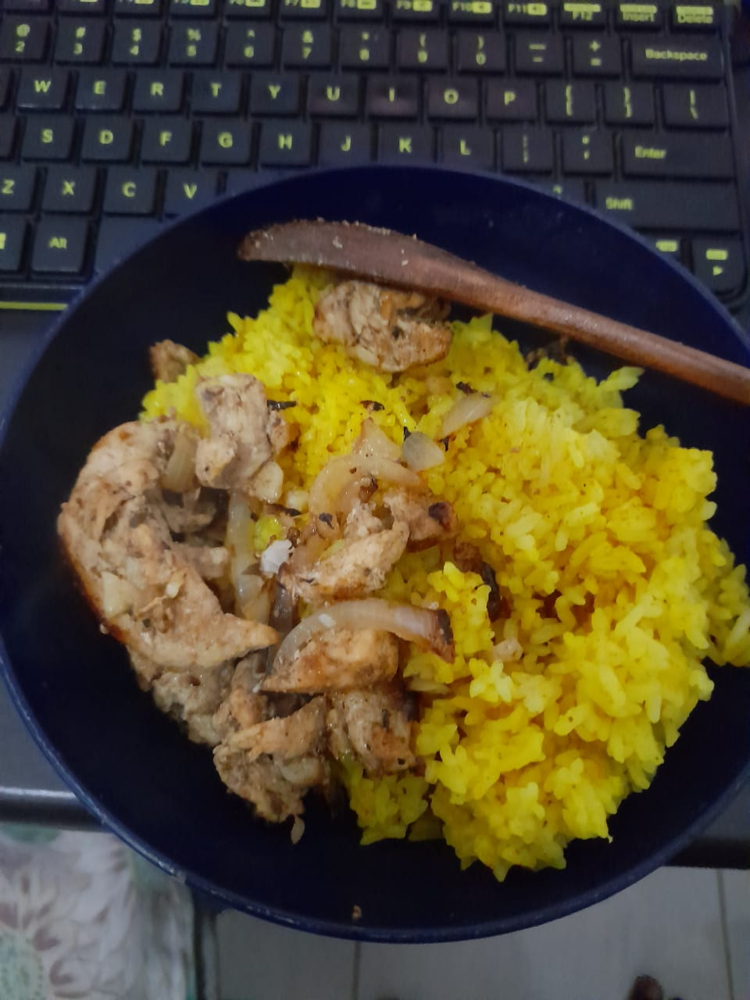

# MEALS :bento:

---

## Iron Sandwich :bread: :egg:

### Ingredients

1. Sliced Bread
2. Any mix you want for your sandwich

### Tools

1. Iron (I named it iron sandwich with a purpose)

### Steps

1. Combine your mixture to create the sandwich and then cook it with iron.
2. Done!

### Additional Notes

1. This was originally my experience when living in the place that doesn't have any proper kitchen so I use my iron to cook it. My favorites is 'grilled-cheese'-like sandwich.
2. Please cover your precious sandwich with aluminum foil first before put it on an iron. Don't forget to turn back so it cooked well
3. If you are broke enough and don't have any kitchen, iron is the best alternative to cook anything (anything that grilled I guess).

---

## Beaten Bread :bread: :egg:

### Ingredients

1. Eggs (1 or 2)
2. Sliced bread (2-3 pieces)
3. Salt and pepper

### Steps

1. Beaten the eggs and add salts and peppers
2. Bath the bread to egg and cook it (**DO NOT USE IRON LIKE THE FIRST RECIPE TO COOK THIS. USE PROPER COOKING TOOLS**). Don't forget to turn back the other side. Don't undercooked it (it tastes worst if undercooked).
3. Slices the bread and serve.

### Additional Notes

1. Sometimes I slices the bread (after cooked) into 3x3
2. Best meal for breakfast. Don't forget to eat fruits too

---

## Fried-noodle Sandwich :bread: :egg:

### Ingredients

1. Fried Noodles (**I prefer to use Indomie's fried noodles because the taste is beyond other noodles!**)
2. Sliced bread
3. An egg
4. Additional: vegetables and seasoning

### Steps

1. Serve the noodle first. Follow the instructions and make sure it's cooked well.
2. Heat the pan and put the breads first. Till is get little bit brown, cook the egg. I prefer with the sunny side up (you can half-cooked it).
3. Put a half of the noodle to the upside bread. Add the egg and the rest of the noodle and then the other bread. Don't overcooked it. Just do it like other sandwich. Caution the noodle is already well served and if you overcooked it, the noodle will dried up.
4. Put it on the plate, slice the sandwich diagonally and serve.

### Additional notes

1. This is the best sandwich ever. The flavor of the fried noodles with juicy seasoning on it goes through the bread to your mouth with half-cooked egg that enrich the taste. Brilliants!

2. **DON'T ADD ANY CHEESE ON IT! IT'S NOT SAMYANG**

3. Just 1 portion is enough for me

---

## Pan-Roasted Potatoes :potato:

### Ingredients

1. Potatoes (of course!) cut it into half or 2-bite size (?)
2. Olive oil 
3. Salt
4. Pepper

### Steps

1. Pour olive oil to the pan and add salt
2. Put the potatoes into it. Let it cook with medium het for 10-12 minutes
3. Turn to low heat for 20 minutes and cover the pan

### Additional notes

1. Add this to a salad and that's perfect
2. Eat with it scramble eggs, with some cheese on it or add some beef jerky

---

## Cheesey Potatoes :potato::cheese:

### Ingredients

1. Potatoes. I only have small potatoes, so roughly about 3 small potatoes or 2 medium
2. Unsalted butter. Approx 2 tablespoons. I think I might using margarin instead
3. All-purpose flour. I'm using cornstarch (1 tablespoon) + fiber creme (not higher than 40g).
4. chopped onion. I don't have any preferences with this but 1/2 is enough
5. Salt
6. Pepper
7. 1 clove garlic, minced of course + a pinch of garlic powder
8. Parsley (Unfortunately I don't have any)
9. Milk! A cup with room temperature or you can heat it first. I think I will use goat milk again
10. Cheese! Cheddar + parmesan (powder)

### Steps

1. Melt the butter or margarin on the pan. Cook the onion and garlic, add some salt and pepper
2. Pour the flour until it has thick texture then add the milk
3. Let it boil for a sec then add the potatoes. Cover the pan for 17 minutes or untill the potatoes is softened. Always stir the potatoes or it might get burned to the pan
4. Add the cheddar cheese and let it melt, buddy
5. Serve with parsley and parmesan

### Additional notes

1. Eat with it scramble eggs!

---

## The Halal Guys Chicken Clone

***Note**: this recipe is not done yet because of some ingredient is not available when I made it*

### Ingredients

**Rice**

- 2 cups (1 cup = 110ml) of rice. Using basmati rice is recommended. I'm using long-grain rice btw and it's fine
- Oil, 1-2 tablespoons. I'm using olive oil, but using any vegetable oil should be fine
- 2-3 teaspoon caraway. It's recommended to using cumin, twice amount. Actually, it's almost 1 tablespoon, don't add to much because caraway has a strong flavor.
- 3 teaspoon turmeric. 
- 2 cups of water (220 ml)
- 1 cup of chicken broth
- A pinch of salt

**Chicken**

*note*: I forgot to measure this one. I will update this if I make this again.

- boneless chicken chunk
- oil (1~2 tablespoon)
- onions, chopped
- Coriander (~2 teaspoons)
- Caraway. Again if you have cumin, just use cumin. (~2 teaspoons)
- Salt, a pinch
- Black pepper. (~1 teaspoon)
- Oregano leaves (~1 tablespoon)

Steps

**Rice**

Here, I'm using a rice cooker that common in Indonesia

1. Heat the oil on the inner bowl, add turmeric, caraway. Stir well then add chicken broth, water, rice, and a pinch of salt. If you're using rice cooker like me, for every period of time, take a look and stir the rice (? pardon for my poor choice of words). If it's already boiled, leave it.
2. wait till the rice is cooked.

**Chicken**

You can make this earlier and leave it marinated for a night

1. Chicken and all the ingredients except onions mixed. Make sure the seasoning is evenly distributed. You can keep the chicken in the freezer or marinate it for a night in the refrigerator
2. Heat the oil on the pan in medium heat. Put onions and cooked them.
3.  After the onion is spread, put the chicken. Don't forget to flip the chicken. My best practice is to know if the chicken is cooked if its no longer wet or no water comes out from the chickens

And done. The things that I haven't done are adding lemon juice to my chicken, using basmati rice and make famous the white sauce (I'm pretty sure it was a combination of yogurt and mayo, but I doubt it).

--
